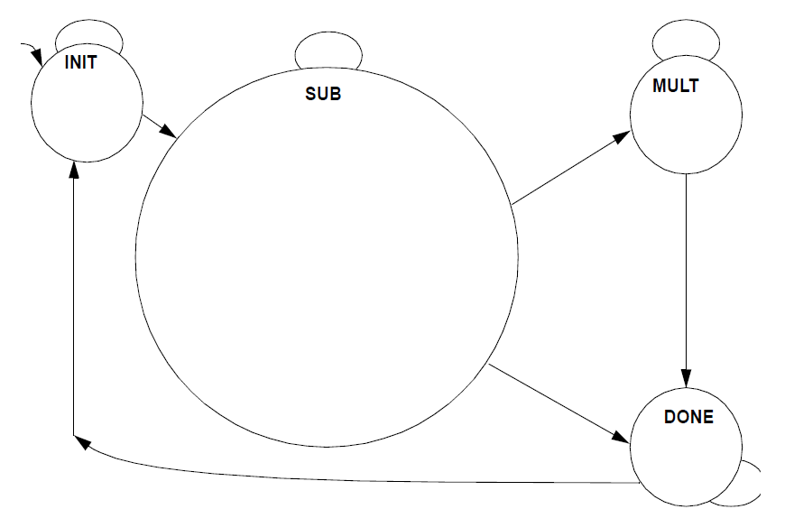

# 总结

课内合作作业，个人独立完成。通过Verilog设计状态机，计算最大公因数。

最大公因数的算法多样，中学已学过古代的辗转相除和交叉相减法。考虑到硬件实现，选择[二进制GCD算法](https://en.wikipedia.org/wiki/Binary_GCD_algorithm)。

模块采用三段式状态机，状态切换和数值计算为时序逻辑实现，次态计算通过组合逻辑实现。模块提供复位和输出信号有效管脚，操作数位数可在调用时设置。

## 算法

$gcd(u,u) = u$

$gcd(2u,2v) = 2gcd(u,v)$

$gcd(2u,v) = gcd(u,v)$

$gcd(u,v) = gcd(|u-v|, min(u,v))$ (u, v are both odd)

模块初始为Init状态，识别到start后进入Sub状态。

Sub状态下判断两数否相等，若相等，则次态进入Mult状态，否则次态为Sub。Sub状态下按算法计算更新操作数数值，若两数均为偶数则均右移一位并使计数器加一，否则若有一偶数则将其右移一位，否则若a>b则更新a为a-b，否则更新b为b-a。

当a=b相等时，次态b会变为0，此时取a的值左移计数器数值即得结果。