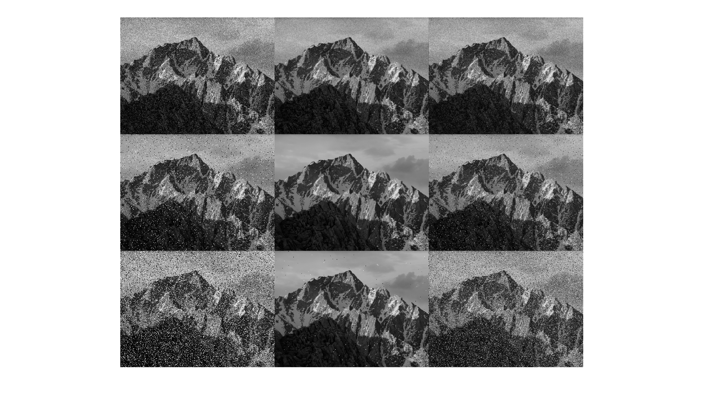
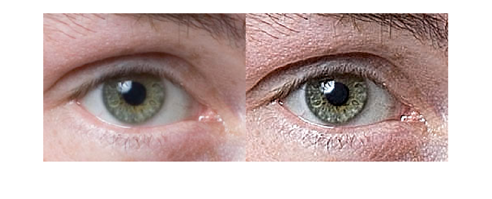
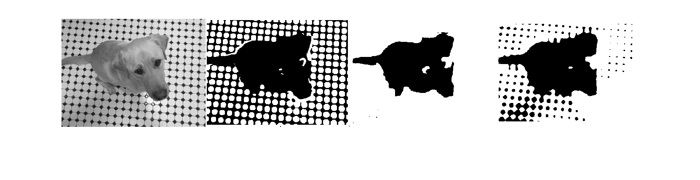
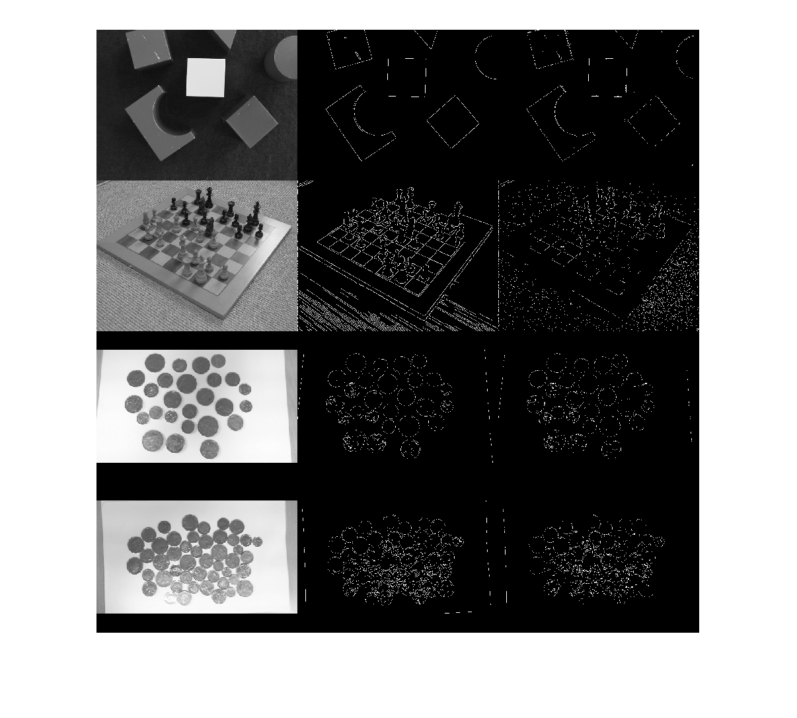

# 实验二

## 图像滤波

对比了滑动平均滤波和高斯滤波对椒盐和高斯噪声的处理效果。

椒盐噪声为极大或极小值，故均值滤波对椒盐噪声效果较好。

高斯滤波更适于处理高斯噪声。

## 锐化

在RGB和Lab空间使用不同参数对图像进行锐化操作，通过低通滤波和求差值，提取图像高频部分。

## 材质提取

将图像与不同材质的核卷积，再进行阈值分割，可以针对材质进行图像分割。

## 边缘检测

使用Canny和Sobel算子进行边缘检测。

Sobel算子计算图像梯度后阈值分割提取边缘。

Canny算子分多个步骤：

1. 对图像进行高斯滤波去除噪声;

2. 提取梯度;

3. 舍去梯度值过小点；

4. 通过双阈值，分离出强边缘和弱边缘；

5. 只保留与强边缘相连的弱边缘。

Canny算子的检测效果通常好于Sobel，使用更广泛。

