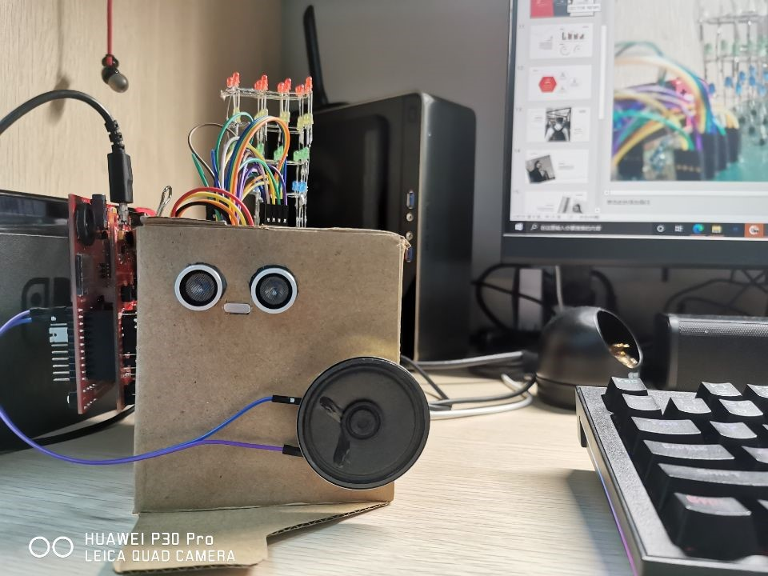

# 总结

[Demo](https://youtu.be/cYnwigkT1nc)

系统实现dac音频播放、光立方、按键控制、手势控制、用户活动感应等功能。

光立方是队友焊的，视频是队友剪的，我就是个臭写代码的。

小学期还是收获挺多，课程作业项目一套下来对嵌入式和C的理解都上了一个层次。

作业的PID控制题也很有意思。可我不懂PID，自己想了个连P控都算不上的反馈控制系统，最终效果并不完美，遗憾。

下一届减负，删了好多内容，也包括这个大作业。做助教时遇到不少对此充满热情的同学，少了这个，有点可惜。

## 项目分析

本项目的难点在于协调多项独立硬件功能。SD卡读写、墨水屏显示、DAC输出、光立方输出、按键响应、手势检测、用户活动检测需要整合进一套系统中。

作为非CS学生，C语言功底其实并不扎实，代码的设计挺糟糕的。运行效率算是亮点，但可读性相当差，这也显著降低了开发和调试效率。C的学习之路还很漫长。

尽管嵌入式开发常常需要较高的运行效率来弥补硬件性能的羸弱，设计中依然存在许多待改进之处。

不会CPP不懂OOC，函数式编程用得也不咋地，所有的动作穿插在一起，导致主函数的逻辑相当复杂。尽管很不爽，限于开发时间和设备性能最后也只能做成这样了。

## 细节介绍

### SD卡读写

初始化后的第一步。一年多前仅一学期的C课程并不足以让我熟悉文件系统和C语言文件处理，根本不敢乱动示例代码。后面IO口不够，来扣几个管脚都小心翼翼。

### 墨水屏

很有意思的模块，尝试过做个电子单词本或诗集。

使用难度较大。模块采用独立芯片，需通过I2C协议通信，工作模式复杂，还需对图片进行专门的转码预处理。

局部刷新，横向显示等功能都需费功夫摸索，当时繁琐的操作已经记不清了。虽然整出来了，但若要复现估计又得抓瞎。

### 按键

中断响应，主函数处理。

### DAC输出

音频输出的硬件连接关系有点复杂，DAC过功放后应是并联了耳机口、蜂鸣器接口和扬声器接口，但代码中的控制部分并不复杂。

需要理解音频播放的原理，对采样率、数据位数和文件格式进行选择。

### 手势控制

超声波传感器，炫酷的效果只需简单的原理。参照模块手册配置即可。一维距离检测，根据距离变化识别手势。

### 光立方

本想显示音频频谱，但IO引脚有限，光立方采用层选+柱选的方式控制，没法实现任意的LED亮灯组合。

由于刷新帧率不高，可以编码+芯片方式控制LED。不过后期修改硬件设计难度过大，没有采用。

此外，计算资源也有限，CPU已经基本吃满，就算优化也很难挤出实时傅立叶这种功能需要的计算资源。

提前算好频谱存进内存好像空间不够，存进sd卡又不太会读，最后只好放弃。

逐帧设计了几组动画，踩着节拍随机循环播放的视觉效果令人满意。

不太通乐理，其实不记得最后到底有没有把30帧的动画和22.05k的音频对上节拍。

### 红外传感器

用于检测观众活动。参照模块手册配置即可。

若一段时间内没检测到用户活动则暂停播放。通过定时器实现。
