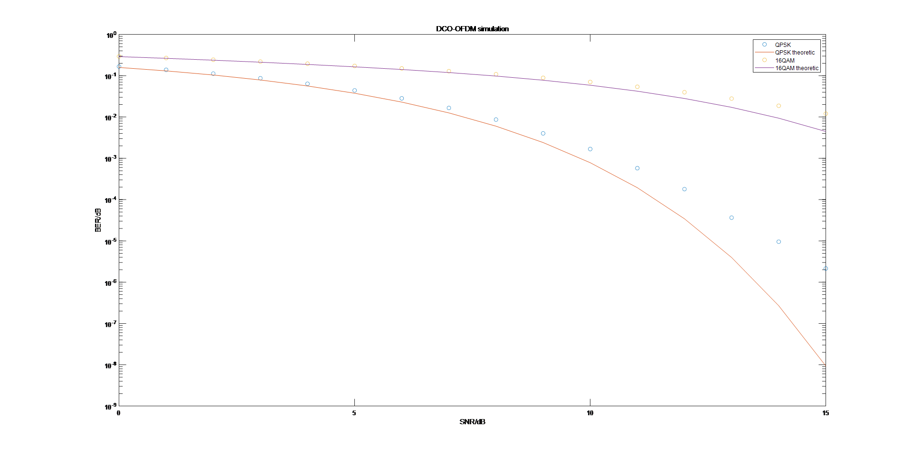

# 总结

实验四实现LED信道上的DCO-OFDM仿真，基本涵盖了之前的实验内容。

Matlab提供的函数和语法与仿真内容十分契合，代码可以写得简洁且高效。

考虑到信道特性已知且相对静态，选择在发射端进行均衡。此时各子载波符号能量一致，可直接套用AWGN误码率公式。

可以看出两种调制方式的仿真误码率和理论值相近。

由于信道拖尾长度小于CP长度，故均衡可完全消除信道的影响。

通过仿真结果可以看出，系统性能接近加性高斯白噪声信道，即循环前缀和均衡很好地消除了信道干扰。

当信噪比较大时误码率会上升，将K值增大后仿真误码率逼近理论误码率，故此差异应是截断噪声所致。

观察信道响应序列，可以发现序列末端值已接近0，故所取的信道响应序列应能较好地反映模型特性。
